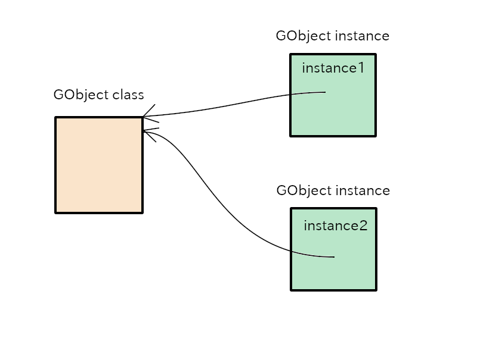

# GObject

## 类和实例

GObject实例使用`g_object_new`函数构造。
GObject不仅有实例还有类。

- 一个GObject类在第一次使用函数`g_object_new`时创建。
然后只存在一个GObject类。
- GObject实例只要在`g_object_new`使用时就会被创建。
所以，两个或更多的GObject实例可以同时存在。

广义上说，GObject意味着对象，包括其类和实例。
狭义上说，GObject是一个C结构的定义。

~~~C
typedef struct _GObject  GObject;
struct  _GObject
{
  GTypeInstance  g_type_instance;
  
  /*< private >*/
  guint          ref_count;  /* (atomic) */
  GData         *qdata;
};
~~~

`g_object_new`函数分配GObject结构体大小的内存，初始化内存并且返回这个内存的指针。
这块内存是一个GObject实例。

同样地，GObject类的内存也由`g_object_new`分配并且它的结构由GObjectClass定义。
接下来的内容是从`gobject.h`拖取的。
但是你现在不需要知道这个结构的细节。

~~~C
struct  _GObjectClass
{
  GTypeClass   g_type_class;

  /*< private >*/
  GSList      *construct_properties;

  /*< public >*/
  /* seldom overridden */
  GObject*   (*constructor)     (GType                  type,
                                 guint                  n_construct_properties,
                                 GObjectConstructParam *construct_properties);
  /* overridable methods */
  void       (*set_property)		(GObject        *object,
                                         guint           property_id,
                                         const GValue   *value,
                                         GParamSpec     *pspec);
  void       (*get_property)		(GObject        *object,
                                         guint           property_id,
                                         GValue         *value,
                                         GParamSpec     *pspec);
  void       (*dispose)			(GObject        *object);
  void       (*finalize)		(GObject        *object);
  /* seldom overridden */
  void       (*dispatch_properties_changed) (GObject      *object,
					     guint	   n_pspecs,
					     GParamSpec  **pspecs);
  /* signals */
  void	     (*notify)			(GObject	*object,
					 GParamSpec	*pspec);

  /* called when done constructing */
  void	     (*constructed)		(GObject	*object);

  /*< private >*/
  gsize		flags;

  gsize         n_construct_properties;

  gpointer pspecs;
  gsize n_pspecs;

  /* padding */
  gpointer	pdummy[3];
};
~~~

GObject的程序包含在GLib源文件中。
你可以从[GNOME下载页面](https://download.gnome.org/sources/glib/)中下载GLib源文件。

在GObject教程源中的[src/misc](misc)文件夹中有例式程序。
你可以通过以下方式编译它们：

~~~
$ cd src/misc
$ meson setup _build
$ ninja -C _build
~~~

One of the programs is `example1.c`.
Its code is as follows.

@@@include
misc/example1.c
@@@

- 5-6: `instance1` and `instance2` are pointers that points GObject instances.
`class1` and `class2` points a class of the instances.
- 8-11: A function `g_object_new` creates a GObject instance.
GObject instance is a chunk of memory which has GObject structure (`struct _GObject`).
The argument `G_TYPE_OBJECT` is the type of GObject.
This type is different from C language type like `char`  or `int`.
There is *Type System* which is a base system of GObject system.
Every data type such as GObject must be registered to the type system.
The type system has series of functions for the registration.
If one of the functions is called, then the type system determines `GType` type value for the object and returns it to the caller.
`GType` is an unsigned long integer on my computer but it depends on the hardware.
`g_object_new` allocates GObject-sized memory and returns the pointer to the top address of the memory.
After the creation, this program displays the addresses of instances.
- 13-16: A macro `G_OBJECT_GET_CLASS` returns the pointer to the class of the argument.
Therefore, `class1` points the class of `instance1` and `class2` points the class of `instance2` respectively.
The addresses of the two classes are displayed.
- 18-19: `g_object_unref` will be explained in the next subsection.
It destroys the instances and the memory is freed.

Now, execute it.

~~~
$ cd src/misc; _build/example1
The address of instance1 is 0x55895eaf7ad0
The address of instance2 is 0x55895eaf7af0
The address of the class of instance1 is 0x55895eaf7880
The address of the class of instance2 is 0x55895eaf7880
~~~

The locations of two instances `instance1` and `instance2` are different.
Each instance has its own memory.
The locations of two classes `class1` and `class2` are the same.
Two GObject instances share the same class.

{width=10cm height=7.5cm}

## 引用计数

GObject实例有它自己的内存。
它们在创建时由系统分配。
当它们变得无用时，内存必须被释放。
可是，我们怎么决定它是否是无用的呢？
GObject提供了引用计数机制来解决这问题。

一个实例被创建并且被另一个实例或者主程序应用。
那就是说，这个实例被引用了。
如果这个实例被A和B引用，那么这个引用的数字是2。
这个数字被称为*引用计数*.
让我们幻想一种类似于下面的情景： 

- A使用了`g_object_new`并且拥有了一个实例G。
A引用了G，所以G的引用计数是1。
- B也想用G。
B使用了`g_object_ref`并且增加了1点引用计数。
现在这个引用计数是2。
- A不再使用G。
A使用`g_object_unref`并且减少了1点引用计数。
现在这个引用计数是1。
- B不再使用G。
B使用`g_object_unref`并且减少了1点引用计数。
现在这个引用计数是0。
- 因为这个引用计数是0，G知道没人引用它。
G自己开始了终结化进程。
G消失然后这个内存被释放。

A program `example2.c` is based on the scenario above.

@@@include
misc/example2.c
@@@

Now execute it.

~~~
$ cd src/misc; _build/example2
bash: cd: src/misc: No such file or directory
Call g_object_new.
Reference count is 1.
Call g_object_ref.
Reference count is 2.
Call g_object_unref.
Reference count is 1.
Call g_object_unref.
Now the reference count is zero and the instance is destroyed.
The instance memories are possibly returned to the system.
Therefore, the access to the same address may cause a segmentation error.
~~~

`example2` shows:

- `g_object_new` creates a new GObject instance and sets its reference count to 1.
- `g_object_ref` increases the reference count by 1.
- `g_object_unref` decreases the reference count by 1.
If the reference count drops to zero, the instance destroys itself.

## 初始化和销毁进程

真正的GObject初始化和销毁过程非常复杂。
接下来是没有讲述细节的简化描述。

初始化

1. 使用类型系统注册GObject类型。
这在函数`main`被调用前在GLib初始化过程中完成。
(如果编译器是gcc，那么`__attribute__ ((constructor))`被用来修饰初始化函数。
参考[GCC手册](https://gcc.gnu.org/onlinedocs/gcc-10.2.0/gcc/Common-Function-Attributes.html#Common-Function-Attributes).)
2. 分配空间给GObjectClass和GObject结构。
3. 初始化GObjectClass结构内存。
这块内存将是GObject的类。
4. 初始化GObject结构内存。
这块内存将是GObject实例。

这个初始化步骤在`g_object_new`函数被第一次调用时执行。
在第二次和后续的`g_object_new`调用中，它只执行两个步骤：(1) GObject结构的内存分配 (2) 初始化内存。
`g_object_new`返回指向这个实例的指针（分配给GObject结构的内存）。

销毁

1. 破坏GObject实例。实例的内存被释放。

GObject类型是一个静态类型。
静态类型永不破坏它的类。
所以即使破坏的实例是最后一个实例，类仍然存在。

当你写代码去定义一个GObject的子对象时，理解以上步骤很重要。
详细的步骤将在后续章节解释。
